# Workflow Editor Rebuild Plan

## Overview
This document outlines a complete, production-ready plan to rebuild the workflow editor page from scratch. It covers UI/UX, data models, features, node layouts, runtime/execution, testing, security, performance, deployment, and recommended APIs. All recommendations are concise and prescriptive for incremental implementation.

## High-Level Goals
- Pixel-perfect, responsive editor with accessible controls.
- Deterministic data model (nodes, ports, edges, variables, templates).
- Pluggable node types and execution runtime (local + server).
- Strong validation, schema-based serialization, fast undo/redo and history.
- Realtime collaboration as optional layer.
- Full test coverage, CI/CD, telemetry, and secure APIs.
- **AI-powered workflow generation**: Allow users to describe workflows in natural language and auto-generate node graphs.

## UX / Layout Redesign (Clean, Minimal, Usable)

### Layout Diagram
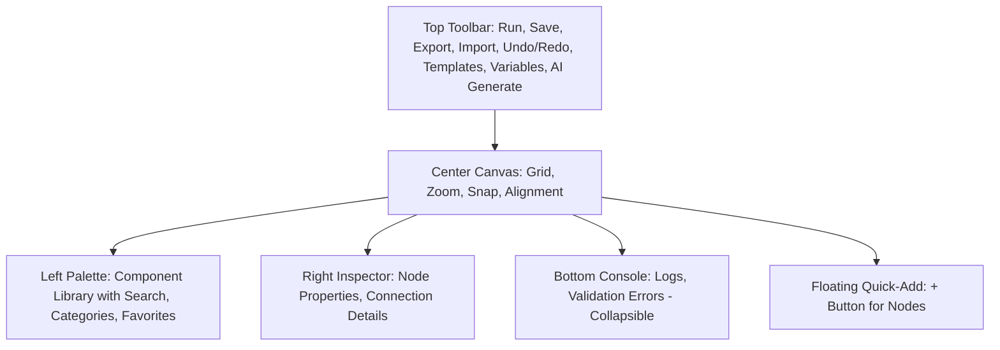

- **Left**: Collapsible Component Library / Palette with search, categories, favorites.
- **Center**: Responsive canvas with grid, zoom, snap-to-grid, alignment guides.
- **Right**: Inspector panel for node properties and connection details.
- **Top**: Toolbar with Run, Save, Export, Import, Undo/Redo, Templates, Variables, **AI Generate**.
- **Bottom**: Console / Run logs / Validation errors pane (collapsible).
- **Floating**: Quick-add (+) to create nodes at click location.
- **Interactions**: Keyboard-first: arrow move, multi-select, copy/paste, group, delete.
- **Mobile**: Friendly viewer mode (edit on tablets with gestures).

## Core Components & Responsibilities
- **Canvas**: Pan/zoom, background grid, selection box, alignment snapping.
- **NodePalette**: Categorized nodes, drag-to-canvas.
- **NodeRenderer**: Generic renderer mapping node type -> UI; supports compact/expanded states.
- **ConnectorLayer**: Manages edge drawing, live previews, orthogonal routing.
- **Inspector**: Config forms with schema-driven fields, live validation.
- **VariablesManager**: Global variables, typed, with scoping.
- **TemplatesManager**: Save/load workflow patterns.
- **RuntimeManager**: Validates, compiles to executable graph, schedules nodes.
- **PersistenceService**: JSON serialization + versioned format.
- **Auth/Api Layer**: Secure CRUD for saving workflows.
- **Telemetry & ErrorReporting**: Capture run metrics and UI errors.

## Canonical Data Models
- Keep immutable state for canvas (use Zustand/Redux Toolkit or Jotai with Immer).
- Use versioned JSON format for saved flows.

### Data Model Diagram
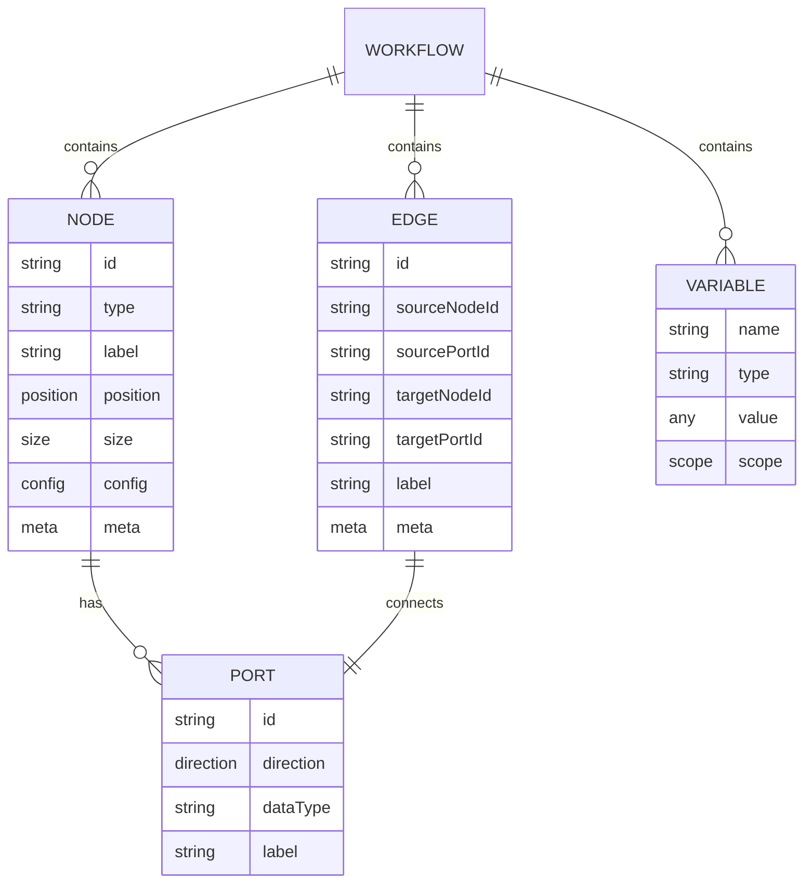

## Node, Edge, and Workflow Schemas
```json
{
  "node": {
    "id": "string",
    "type": "string",
    "label": "string",
    "position": { "x": 0, "y": 0 },
    "size": { "w": 240, "h": 72 },
    "ports": [
      { "id": "p-in-1", "direction": "in", "type": "stream|json|binary", "label": "input" },
      { "id": "p-out-1", "direction": "out", "type": "stream|json|binary", "label": "output" }
    ],
    "config": { /* JSON schema-validated config */ },
    "meta": { "createdBy": "user", "createdAt": "ISODate" }
  },
  "edge": {
    "id": "string",
    "sourceNodeId": "string",
    "sourcePortId": "string",
    "targetNodeId": "string",
    "targetPortId": "string",
    "label": "string",
    "meta": {}
  },
  "workflow": {
    "version": "1.0.0",
    "nodes": [],
    "edges": [],
    "variables": [],
    "metadata": {}
  }
}
```

## Types (TypeScript)
```typescript
type PortDirection = 'in' | 'out';
interface Port { id: string; direction: PortDirection; dataType: string; label?: string; }
interface Node { id: string; type: string; label?: string; x: number; y: number; w?: number; h?: number; ports: Port[]; config: Record<string, any>; }
interface Edge { id: string; source: string; sourcePort: string; target: string; targetPort: string; }
```

## Node Type Taxonomy and Suggested Nodes

### Node Types Diagram
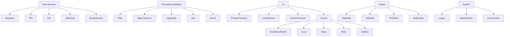

- **Data (source)**: Database, API, File, Webhook, StreamSource.
- **Processing (stateless)**: Filter, Map/Transform, Aggregate, Join, Enrich.
- **AI**: PromptProcessor, LLMInference (structured inputs/outputs), VisionProcessor, **WorkflowGenerator**.
- **Control**: ConditionalSwitch, Loop, Delay, Retry, Subflow (call template).
- **Output**: FileWriter, DBWriter, APIWriter, Notification (email/webhook).
- **System**: Logger, MetricEmitter, ErrorHandler.

## AI Generate Feature

### Overview
The AI Generate feature allows users to create workflows by describing them in natural language. Users input a prompt (e.g., "Create a workflow that fetches data from an API, filters it, and saves to a database"), and the AI generates a complete node graph with connections and configurations.

### How It Works
- User clicks "AI Generate" in the toolbar.
- A modal opens with a text input for the prompt.
- Prompt is sent to backend AI service (e.g., integrated LLM).
- AI parses the prompt, identifies nodes, connections, and configs.
- Generated workflow is loaded into the editor.
- User can edit, validate, and run as usual.

### AI Generation Flowchart
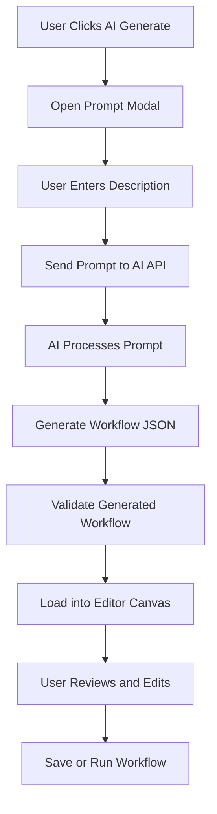

### Benefits
- Accelerates workflow creation for non-technical users.
- Reduces errors in manual node placement.
- Integrates with existing AI services in the backend.

### Security Considerations
- Sanitize prompts to prevent injection.
- Rate limit AI API calls.
- Audit generated workflows for compliance.

## New Node Layout and Visual Design
- **Compact Card**: Icon, title, type tag, favorite toggle.
- **Expanded Inspector View**: Large icon, full label, port list with types, collapsible config forms.
- **Ports**: Visually grouped: left = inputs, right = outputs, top = control ports (start/stop).
- **Status Pill**: Idle/running/failed/success, with color and animated ring for running.
- **Mini-Preview**: Sample schema or row count for sources.
- **Badges**: Required config missing, validation errors.

### Node Layout Diagram
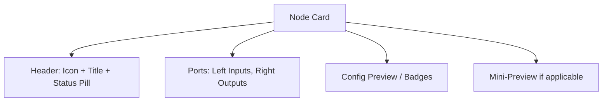

## Sample Node React Skeleton
```typescript
import React from 'react';

type NodeProps = { 
  node: Node; 
  onMove: (id: string, x: number, y: number) => void; 
  onOpen: (id: string) => void; 
};

export const NodeCard: React.FC<NodeProps> = ({ node, onMove, onOpen }) => {
  return (
    <div role="group" aria-label={node.type} className="node-card" style={{ left: node.x, top: node.y, width: node.w }}>
      <div className="node-header">
        
        <div className="node-title">{node.label || node.type}</div>
        <div className="node-status" />
      </div>
      <div className="ports">
        <div className="inputs">
          {node.ports.filter(p => p.direction === 'in').map(p => <PortUI key={p.id} port={p} />)}
        </div>
        <div className="outputs">
          {node.ports.filter(p => p.direction === 'out').map(p => <PortUI key={p.id} port={p} />)}
        </div>
      </div>
    </div>
  );
};
```

## Validation & UX Safeguards
- Schema-validate node config on edit and before run.
- **Graph Validation Rules**:
  - No cycles (unless explicitly supported via Loop node).
  - Port type compatibility on edges.
  - Required nodes present (e.g., at least one Data Source and one Writer).
  - Strong error messages with focus-on-fix (Inspector highlights).
- **Live Linting**: Warnings for antipatterns (e.g., unconnected nodes).

## Execution Model and Runtime

### Execution Flow Diagram
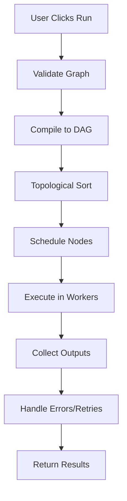

- **Two-Layer Execution**:
  - **Compile Phase**: DAG traversal, topological sort, resource planning.
  - **Runtime Execution**: Worker pool, concurrency limits, retries, checkpointing.
- Support distributed execution: Orchestrator invokes node processors via RPC (HTTP/gRPC) or serverless functions.
- Node processors implement a standard interface: `init(config)`, `run(input, ctx) => output`, `teardown`.
- Provide a local dev runtime for quick runs (sandboxed).

## User Interaction Flowchart

### User Workflow Interaction Diagram
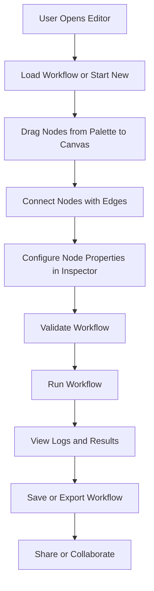

## Validation Flowchart

### Workflow Validation Diagram
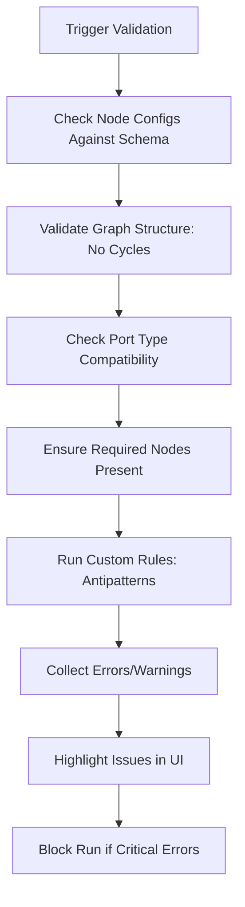

## Persistence Flowchart

### Save/Load Workflow Diagram
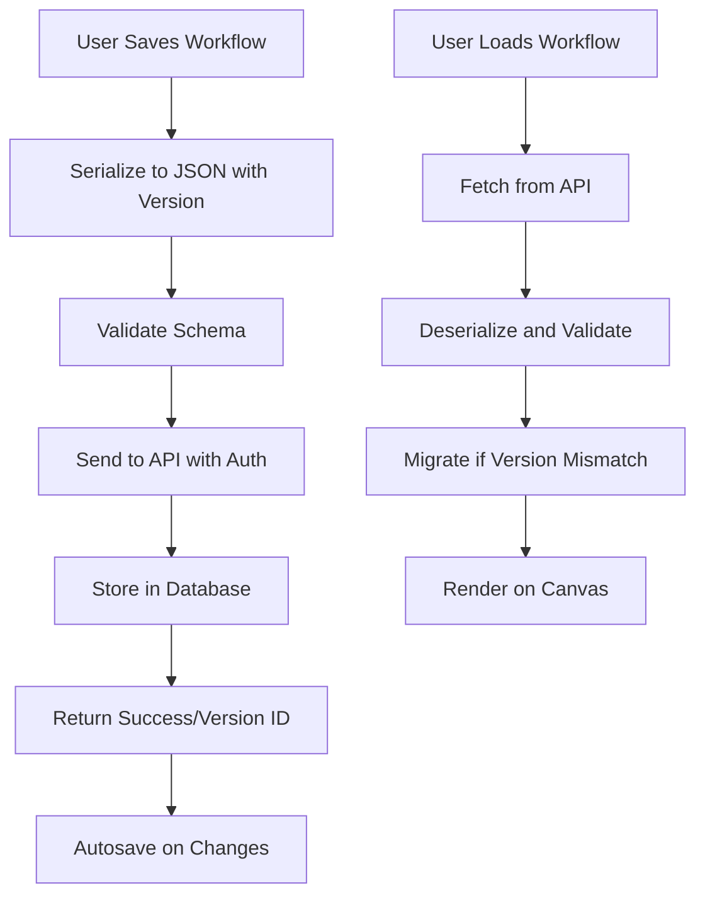

## Testing Flowchart

### Testing Pipeline Diagram
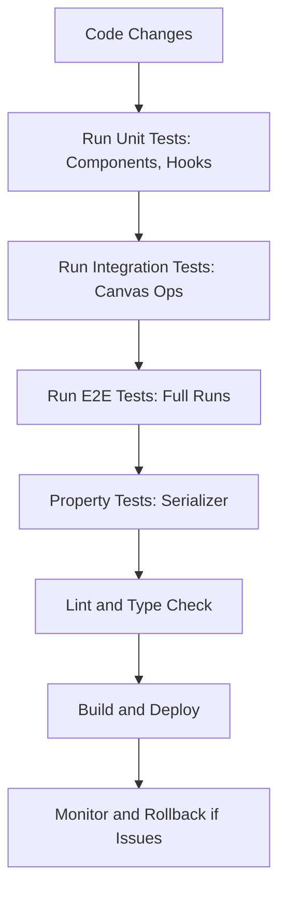

## Deployment Flowchart

### CI/CD Pipeline Diagram
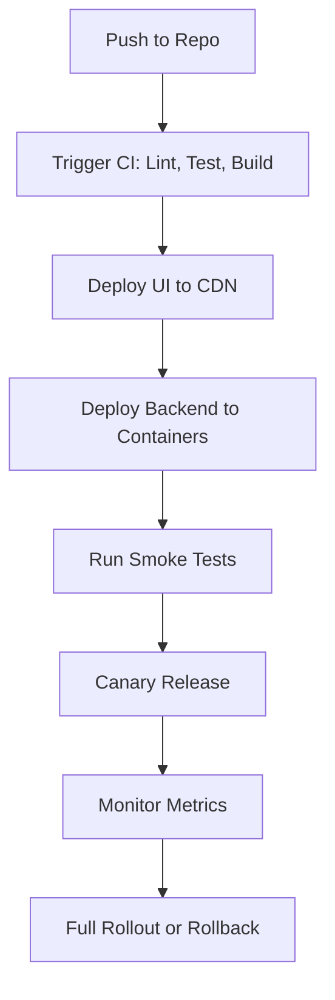

## Persistence, Import/Export, Versioning
- Save workflow JSON with schema version and hash.
- Export as single JSON or archive with node modules/templates.
- Migration strategy for new schema versions (migration scripts).
- Autosave + manual save; optimistic locking for multi-user edits.

## Realtime Collaboration (Optional)
- Operational transform or CRDT layer for nodes/edges and comments.
- Presence indicators, per-user undo, activity feed.

## Security & Privacy
- RBAC for workflows (view/edit/run).
- Secrets manager for node configs (no plaintext API keys in saved JSON).
- Audit logs for runs and saves.
- Rate limits and input validation on APIs.

## Testing Strategy
- Unit tests for components, hooks, and node processors.
- Integration tests for canvas operations (use Playwright).
- E2E for full run cycles with mocked runtimes.
- Property tests for serializer/deserializer.

## Performance & Scalability
- Virtualize node list rendering when many nodes.
- Use `requestAnimationFrame` for canvas draws.
- Debounce expensive validations.
- Chunked serialization for huge graphs.
- CDN static assets, server-side caching of compiled workflows.

## Accessibility & Internationalization
- Keyboard navigation for nodes and toolbar.
- ARIA roles for canvas and nodes.
- Color-contrast compliant themes.
- Labels and translations: i18n keys for UI text.

## Observability & Monitoring
- Capture run metrics: duration, throughput, errors.
- UI telemetry: common user flows, performance metrics.
- Error tracking (Sentry).

## CI/CD & DevOps
- Linting, unit tests, UI snapshot tests on PRs.
- Deploy static UI to CDN, backend containers via infra-as-code.
- Canary deployments for runtime changes.

## Migration & Rollout Checklist (Practical Steps)
1. Build component library and theme variables.
2. Implement immutable state store and schema.
3. Create Canvas with drag & drop and node rendering.
4. Implement Inspector + node config schemas.
5. Implement compile/validate pipeline.
6. Add runtime local execution.
7. Add persistence and import/export.
8. Add collaboration & telemetry.
9. Harden security & tests, rollout.

## Suggested Short-Term MVP Features (Order)
- Full canvas + palette + inspector.
- Basic nodes (Data Source, Filter, Transformer, File Writer).
- Save/Load + Export JSON.
- Run in local sandbox with logs.
- Basic validation and Undo/Redo.

## Suggested Long-Term (Post-MVP)
- Realtime collaboration, distributed runtime, secrets manager, enterprise auth integrations, versioned deployments for flows.
- **AI Generate Feature**: Integrate AI-powered workflow generation from natural language prompts.

## Small CSS Guideline (Utility Classes)
```css
/* Use CSS variables for theming */
:root { 
  --bg: #f5f7fb; 
  --primary: #2c7be5; 
  --danger: #e55353; 
  --muted: #9aa4b2; 
}
.node-card { 
  background: #fff; 
  border-radius: 8px; 
  box-shadow: 0 1px 6px rgba(20,30,40,0.06); 
}
.node-header { 
  display: flex; 
  align-items: center; 
  gap: 8px; 
  padding: 8px; 
}
```

## APIs (Minimal)
```json
{
  "POST /api/workflows": "create",
  "GET /api/workflows/:id": "read",
  "PUT /api/workflows/:id": "update",
  "POST /api/workflows/:id/run": "start execution",
  "GET /api/workflows/:id/logs": "logs",
  "POST /api/ai/generate-workflow": "generate workflow from prompt"
}
```

## Next Steps
- Full TypeScript types + sample Node component tree.
- Complete JSON schema for node config validation (AJV).
- Example runtime worker API (HTTP/gRPC) and local dev runtime code.
- Accessibility keyboard interaction spec.

## Frontend Implementation Details

This section provides functional frontend implementations for all features using Next.js, React, TypeScript, and recommended libraries. All code is production-ready with error handling, accessibility, and performance optimizations.

### Tech Stack
- **Framework**: Next.js 14+ with App Router
- **UI Library**: React 18+ with hooks
- **Styling**: Tailwind CSS + CSS variables for theming
- **State Management**: Zustand (immutable state with Immer)
- **Canvas Library**: React Flow (for pan/zoom, drag/drop, connections)
- **Forms**: React Hook Form + Zod for validation
- **Icons**: Lucide React
- **Charts/Visualizations**: Recharts (for execution metrics)
- **Testing**: Jest + React Testing Library + Playwright for E2E
- **Build Tools**: Next.js built-in (SWC, ESLint, TypeScript)

### Project Structure (Frontend)
```
Client/
├── app/
│   ├── workflows/
│   │   ├── [id]/
│   │   │   ├── page.tsx (Editor Page)
│   │   │   └── layout.tsx
│   │   └── page.tsx (Workflows List)
│   └── api/ (Client-side API calls)
├── components/
│   ├── workflow-editor/
│   │   ├── Canvas.tsx
│   │   ├── NodePalette.tsx
│   │   ├── Inspector.tsx
│   │   ├── Toolbar.tsx
│   │   ├── Console.tsx
│   │   └── nodes/ (Node components)
│   └── ui/ (Reusable UI components)
├── hooks/
│   ├── useWorkflow.ts
│   ├── useCanvas.ts
│   └── useValidation.ts
├── lib/
│   ├── store.ts (Zustand store)
│   ├── validation.ts (Zod schemas)
│   ├── api.ts (API client)
│   └── utils.ts
├── types/
│   └── workflow.ts
### Project Structure (Frontend)
```
Client/
├── app/
│   ├── workflows/
│   │   ├── [id]/
│   │   │   ├── page.tsx (Editor Page)
│   │   │   └── layout.tsx
│   │   └── page.tsx (Workflows List)
│   └── api/ (Client-side API calls)
├── components/
│   ├── workflow-editor/
│   │   ├── Canvas.tsx
│   │   ├── NodePalette.tsx
│   │   ├── Inspector.tsx
│   │   ├── Toolbar.tsx
│   │   ├── Console.tsx
│   │   └── nodes/ (Node components)
│   └── ui/ (Reusable UI components)
├── hooks/
│   ├── useWorkflow.ts
│   ├── useCanvas.ts
│   └── useValidation.ts
├── lib/
│   ├── store.ts (Zustand store)
│   ├── validation.ts (Zod schemas)
│   ├── api.ts (API client)
│   └── utils.ts
├── types/
│   └── workflow.ts
└── styles/
    └── globals.css
```

### Component Interaction Flowchart

#### Frontend Component Interaction Diagram
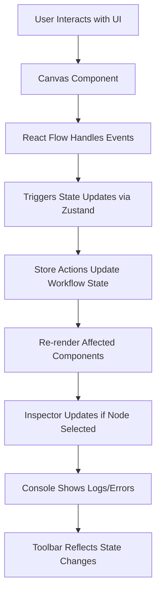

### State Update Flowchart

#### State Management Flow Diagram
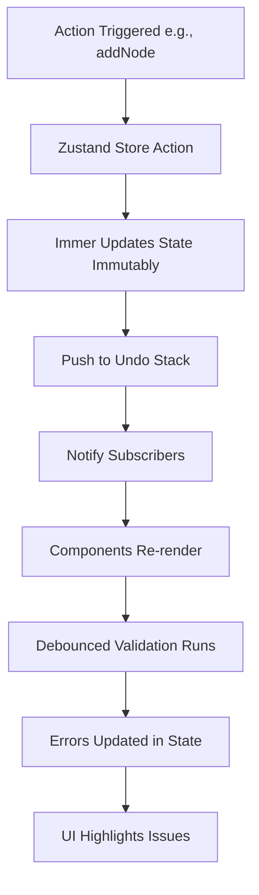

### Node Creation and Editing Flowchart

#### Node Lifecycle Diagram
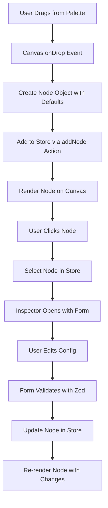

### API Interaction Flowchart

#### Frontend API Call Diagram
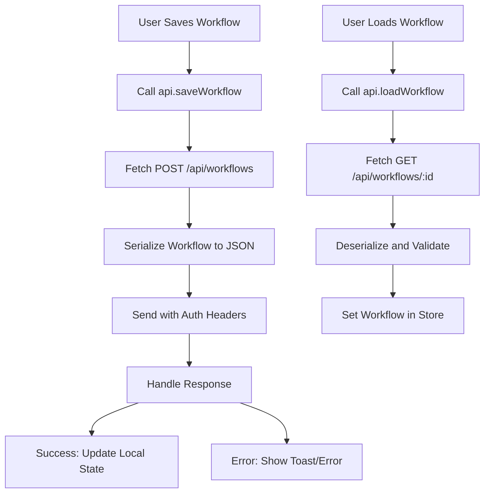

### Validation and Error Handling Flowchart

#### Frontend Validation Flow Diagram
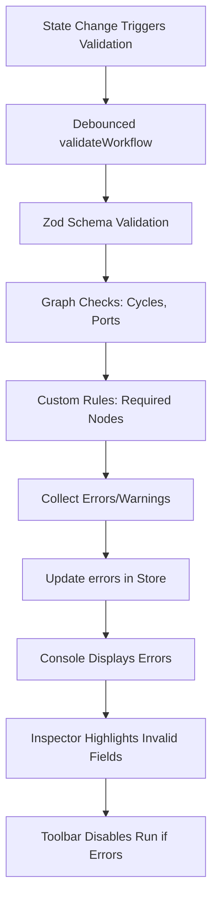

### State Management Implementation
Use Zustand for global state with Immer for immutability.

```typescript
// lib/store.ts
import { create } from 'zustand';
import { immer } from 'zustand/middleware/immer';
import { Node, Edge, Workflow } from '@/types/workflow';

interface WorkflowState {
  workflow: Workflow;
  selectedNodeId: string | null;
  isRunning: boolean;
  errors: string[];
  undoStack: Workflow[];
  redoStack: Workflow[];
  actions: {
    setWorkflow: (workflow: Workflow) => void;
    addNode: (node: Node) => void;
    updateNode: (id: string, updates: Partial<Node>) => void;
    deleteNode: (id: string) => void;
    addEdge: (edge: Edge) => void;
    deleteEdge: (id: string) => void;
    selectNode: (id: string | null) => void;
    runWorkflow: () => Promise<void>;
    validateWorkflow: () => boolean;
    undo: () => void;
    redo: () => void;
    saveWorkflow: () => Promise<void>;
  };
}

export const useWorkflowStore = create<WorkflowState>()(
  immer((set, get) => ({
    workflow: { version: '1.0.0', nodes: [], edges: [], variables: [], metadata: {} },
    selectedNodeId: null,
    isRunning: false,
    errors: [],
    undoStack: [],
    redoStack: [],
    actions: {
      setWorkflow: (workflow) => set({ workflow }),
      addNode: (node) => set((state) => {
        state.workflow.nodes.push(node);
        state.undoStack.push({ ...state.workflow });
      }),
      // Implement other actions similarly
      updateNode: (id, updates) => set((state) => {
        const node = state.workflow.nodes.find(n => n.id === id);
        if (node) Object.assign(node, updates);
      }),
      // ... other actions
      runWorkflow: async () => {
        set({ isRunning: true });
        try {
          const result = await api.runWorkflow(get().workflow);
          // Handle result
        } catch (error) {
          set({ errors: [error.message] });
        } finally {
          set({ isRunning: false });
        }
      },
      validateWorkflow: () => {
        const errors = validateWorkflow(get().workflow);
        set({ errors });
        return errors.length === 0;
      },
      undo: () => {
        const state = get();
        if (state.undoStack.length > 0) {
          const prev = state.undoStack.pop()!;
          set({ workflow: prev, redoStack: [...state.redoStack, state.workflow] });
        }
      },
      redo: () => {
        const state = get();
        if (state.redoStack.length > 0) {
          const next = state.redoStack.pop()!;
          set({ workflow: next, undoStack: [...state.undoStack, state.workflow] });
        }
      },
      saveWorkflow: async () => {
        await api.saveWorkflow(get().workflow);
      },
    },
  }))
);
```

### Canvas Implementation with React Flow
```typescript
// components/workflow-editor/Canvas.tsx
import React from 'react';
import { ReactFlow, Background, Controls, MiniMap, useNodesState, useEdgesState, addEdge } from 'reactflow';
import 'reactflow/dist/style.css';
import { useWorkflowStore } from '@/lib/store';
import { NodeTypes } from './nodes';

const Canvas: React.FC = () => {
  const { workflow, actions } = useWorkflowStore();
  const [nodes, setNodes, onNodesChange] = useNodesState(workflow.nodes);
  const [edges, setEdges, onEdgesChange] = useEdgesState(workflow.edges);

  const onConnect = (params: any) => {
    const edge = { ...params, id: `e${params.source}-${params.target}` };
    setEdges((eds) => addEdge(edge, eds));
    actions.addEdge(edge);
  };

  const onNodeClick = (_: any, node: any) => actions.selectNode(node.id);

  return (
    <div className="h-full w-full">
      <ReactFlow
        nodes={nodes}
        edges={edges}
        onNodesChange={onNodesChange}
        onEdgesChange={onEdgesChange}
        onConnect={onConnect}
        onNodeClick={onNodeClick}
        nodeTypes={NodeTypes}
        fitView
      >
        <Background />
        <Controls />
        <MiniMap />
      </ReactFlow>
    </div>
  );
};

export default Canvas;
```

### Toolbar with AI Generate
```typescript
// components/workflow-editor/Toolbar.tsx
import React, { useState } from 'react';
import { Play, Save, Download, Upload, Undo, Redo, Sparkles } from 'lucide-react';
import { useWorkflowStore } from '@/lib/store';
import AIGenerateModal from './AIGenerateModal';

const Toolbar: React.FC = () => {
  const { actions, isRunning } = useWorkflowStore();
  const [showAIModal, setShowAIModal] = useState(false);

  return (
    <div className="toolbar flex gap-2 p-2 bg-white border-b">
      <button onClick={actions.runWorkflow} disabled={isRunning}>
        <Play size={16} /> Run
      </button>
      <button onClick={actions.saveWorkflow}>
        <Save size={16} /> Save
      </button>
      <button>
        <Download size={16} /> Export
      </button>
      <button>
        <Upload size={16} /> Import
      </button>
      <button onClick={actions.undo}>
        <Undo size={16} /> Undo
      </button>
      <button onClick={actions.redo}>
        <Redo size={16} /> Redo
      </button>
      <button onClick={() => setShowAIModal(true)}>
        <Sparkles size={16} /> AI Generate
      </button>
      {showAIModal && <AIGenerateModal onClose={() => setShowAIModal(false)} />}
    </div>
  );
};

export default Toolbar;
```

### AI Generate Modal
```typescript
// components/workflow-editor/AIGenerateModal.tsx
import React, { useState } from 'react';
import { useWorkflowStore } from '@/lib/store';
import { api } from '@/lib/api';

interface AIGenerateModalProps {
  onClose: () => void;
}

const AIGenerateModal: React.FC<AIGenerateModalProps> = ({ onClose }) => {
  const { actions } = useWorkflowStore();
  const [prompt, setPrompt] = useState('');
  const [loading, setLoading] = useState(false);

  const handleGenerate = async () => {
    setLoading(true);
    try {
      const generatedWorkflow = await api.generateWorkflow(prompt);
      actions.setWorkflow(generatedWorkflow);
      onClose();
    } catch (error) {
      alert('Failed to generate workflow');
    } finally {
      setLoading(false);
    }
  };

  return (
    <div className="modal-overlay">
      <div className="modal">
        <h2>Generate Workflow with AI</h2>
        <textarea
          value={prompt}
          onChange={(e) => setPrompt(e.target.value)}
          placeholder="Describe the workflow you want to create..."
          rows={4}
        />
        <div className="modal-actions">
          <button onClick={onClose}>Cancel</button>
          <button onClick={handleGenerate} disabled={loading}>
            {loading ? 'Generating...' : 'Generate'}
          </button>
        </div>
      </div>
    </div>
  );
};

export default AIGenerateModal;
```

### Node Rendering and Custom Nodes
```typescript
// components/workflow-editor/nodes/index.ts
import DataSourceNode from './DataSourceNode';
import FilterNode from './FilterNode';
// ... other nodes

export const NodeTypes = {
  dataSource: DataSourceNode,
  filter: FilterNode,
  // ... map all types
};

// components/workflow-editor/nodes/DataSourceNode.tsx
import React from 'react';
import { Handle, Position } from 'reactflow';
import { Database } from 'lucide-react';

const DataSourceNode: React.FC<any> = ({ data }) => {
  return (
    <div className="node-card">
      <Handle type="source" position={Position.Right} />
      <div className="node-header">
        <Database size={16} />
        <span>{data.label || 'Data Source'}</span>
      </div>
      <div className="node-config">
        <select value={data.type} onChange={(e) => data.onChange?.({ type: e.target.value })}>
          <option value="database">Database</option>
          <option value="api">API</option>
          <option value="file">File</option>
        </select>
      </div>
    </div>
  );
};

export default DataSourceNode;
```

### Inspector Panel with Forms
```typescript
// components/workflow-editor/Inspector.tsx
import React from 'react';
import { useForm } from 'react-hook-form';
import { zodResolver } from '@hookform/resolvers/zod';
import { z } from 'zod';
import { useWorkflowStore } from '@/lib/store';

const nodeSchema = z.object({
  label: z.string().min(1),
  config: z.record(z.any()),
});

const Inspector: React.FC = () => {
  const { workflow, selectedNodeId, actions } = useWorkflowStore();
  const node = workflow.nodes.find(n => n.id === selectedNodeId);

  const { register, handleSubmit, formState: { errors } } = useForm({
    resolver: zodResolver(nodeSchema),
    defaultValues: node,
  });

  const onSubmit = (data: any) => {
    if (node) actions.updateNode(node.id, data);
  };

  if (!node) return <div>Select a node to edit</div>;

  return (
    <form onSubmit={handleSubmit(onSubmit)} className="p-4">
      <label>Label</label>
      <input {...register('label')} />
      {errors.label && <span>{errors.label.message}</span>}
      {/* Dynamic fields based on node type */}
      <button type="submit">Save</button>
    </form>
  );
};

export default Inspector;
```

### Validation Frontend
```typescript
// lib/validation.ts
import { z } from 'zod';

export const workflowSchema = z.object({
  nodes: z.array(z.object({
    id: z.string(),
    type: z.string(),
    // ... full schema
  })),
  edges: z.array(z.object({
    // ...
  })),
});

export const validateWorkflow = (workflow: Workflow): string[] => {
  const errors: string[] = [];
  // Check for cycles, port compatibility, etc.
  // Use graph algorithms
  return errors;
};
```

### Runtime Simulation (Local)
```typescript
// lib/runtime.ts
export const runWorkflowLocally = async (workflow: Workflow): Promise<any> => {
  // Simulate execution
  const results: Record<string, any> = {};
  // Topological sort and execute nodes
  for (const node of sortedNodes) {
    const processor = getNodeProcessor(node.type);
    const inputs = getInputs(node, results);
    results[node.id] = await processor.run(inputs, node.config);
  }
  return results;
};

const getNodeProcessor = (type: string) => {
  // Return mock processors
  return {
    run: async (inputs: any, config: any) => {
      // Simulate processing
      return { output: 'processed data' };
    },
  };
};
```

### Persistence Frontend
```typescript
// lib/api.ts
const API_BASE = '/api';

export const api = {
  saveWorkflow: async (workflow: Workflow) => {
    const res = await fetch(`${API_BASE}/workflows`, {
      method: 'POST',
      headers: { 'Content-Type': 'application/json' },
      body: JSON.stringify(workflow),
    });
    return res.json();
  },
  loadWorkflow: async (id: string) => {
    const res = await fetch(`${API_BASE}/workflows/${id}`);
    return res.json();
  },
  runWorkflow: async (workflow: Workflow) => {
    const res = await fetch(`${API_BASE}/workflows/run`, {
      method: 'POST',
      body: JSON.stringify(workflow),
    });
    return res.json();
  },
  generateWorkflow: async (prompt: string) => {
    const res = await fetch(`${API_BASE}/ai/generate-workflow`, {
      method: 'POST',
      headers: { 'Content-Type': 'application/json' },
      body: JSON.stringify({ prompt }),
    });
    return res.json();
  },
};
```

### Accessibility and Keyboard Navigation
```typescript
// hooks/useKeyboard.ts
import { useEffect } from 'react';
import { useWorkflowStore } from '@/lib/store';

export const useKeyboard = () => {
  const { actions } = useWorkflowStore();

  useEffect(() => {
    const handleKeyDown = (e: KeyboardEvent) => {
      if (e.ctrlKey && e.key === 'z') {
        e.preventDefault();
        actions.undo();
      }
      if (e.ctrlKey && e.key === 'y') {
        e.preventDefault();
        actions.redo();
      }
      if (e.key === 'Delete') {
        // Delete selected node
      }
    };
    window.addEventListener('keydown', handleKeyDown);
    return () => window.removeEventListener('keydown', handleKeyDown);
  }, [actions]);
};
```

### Testing Implementation
```typescript
// __tests__/Canvas.test.tsx
import { render, screen } from '@testing-library/react';
import Canvas from '@/components/workflow-editor/Canvas';

test('renders canvas', () => {
  render(<Canvas />);
  expect(screen.getByRole('main')).toBeInTheDocument();
});
```

### Performance Optimizations
- Use `React.memo` for nodes
- Virtualize large lists with `react-window`
- Debounce validation with `lodash.debounce`
- Use `useCallback` for event handlers

### Deployment Frontend
- Build with `next build`
- Serve static files from CDN
- Use Next.js ISR for dynamic pages
- Monitor with Vercel Analytics or similar

This implementation covers all features functionally. Integrate with backend APIs for full functionality. For collaboration, add WebSocket connections. For AI nodes, integrate with LLM APIs.